# 📈 Crypto Investment App

# Table of contents

- [📈 Crypto Investment App](#-crypto-investment-app)
- [Table of contents](#table-of-contents)
- [Introduction](#introduction)
	- [Tech Stack](#tech-stack)
	- [Project Demo](#project-demo)
		- [🤳 Screenshots](#-screenshots)
		- [🚶 Walkthrough](#-walkthrough)
- [Project Scope](#project-scope)
	- [Requirements](#requirements)
		- [Functionalities](#functionalities)
	- [Project Architecture](#project-architecture)
		- [Backend](#backend)
		- [Frontend](#frontend)
		- [Folder Structure](#folder-structure)
			- [Backend](#backend-1)
			- [Frontend](#frontend-1)
- [User Flow](#user-flow)
	- [Backend](#backend-2)
	- [Frontend](#frontend-2)
- [Project Management](#project-management)
- [Installation](#installation)
- [Hosted Link](#hosted-link)

# Introduction

Crypto Trading is a web app that displays information about the price, market cap, change in price over time, price charts of various cryptocurrencies like Bitcoin and Ethereum. The app also lets users add assets to their watchlist and mint NFTs on Solana Devnet. (Trading options are coming soon!)

## Tech Stack

| Languages                                                                                                                                                                                                                                                                                                                                                                                                                                                                                       | Back-End                                                                                                                                                                                                                                                                                                                                                                            | Database                                                                                                                                                                                     | Web3                                                                                                                                                                                                                                                                                                                                                                                                                                                                                                                                                                                                                                                       | Front-End                                                                                                                                                                                                                                                                                                                                                                                                                                                                                                                                                                                            | UI Framework                                                                                                                                                                                                 | Hosting                                                                                                                                                                                                                                                                                                                                                                                 |
| ----------------------------------------------------------------------------------------------------------------------------------------------------------------------------------------------------------------------------------------------------------------------------------------------------------------------------------------------------------------------------------------------------------------------------------------------------------------------------------------------- | ----------------------------------------------------------------------------------------------------------------------------------------------------------------------------------------------------------------------------------------------------------------------------------------------------------------------------------------------------------------------------------- | -------------------------------------------------------------------------------------------------------------------------------------------------------------------------------------------- | ---------------------------------------------------------------------------------------------------------------------------------------------------------------------------------------------------------------------------------------------------------------------------------------------------------------------------------------------------------------------------------------------------------------------------------------------------------------------------------------------------------------------------------------------------------------------------------------------------------------------------------------------------------- | ---------------------------------------------------------------------------------------------------------------------------------------------------------------------------------------------------------------------------------------------------------------------------------------------------------------------------------------------------------------------------------------------------------------------------------------------------------------------------------------------------------------------------------------------------------------------------------------------------- | ------------------------------------------------------------------------------------------------------------------------------------------------------------------------------------------------------------ | --------------------------------------------------------------------------------------------------------------------------------------------------------------------------------------------------------------------------------------------------------------------------------------------------------------------------------------------------------------------------------------- |
|  |  |  |  |  |  |  |

## Project Demo

Fusce at mollis justo. Suspendisse eleifend neque diam, et ullamcorper urna gravida vitae.

### 🤳 Screenshots

|                 Cryptos Table View                 |                 Crypto Stats Page                 |               Watchlist Page                |                   NFT Mint Page                   |
| :------------------------------------------------: | :-----------------------------------------------: | :-----------------------------------------: | :-----------------------------------------------: |
| 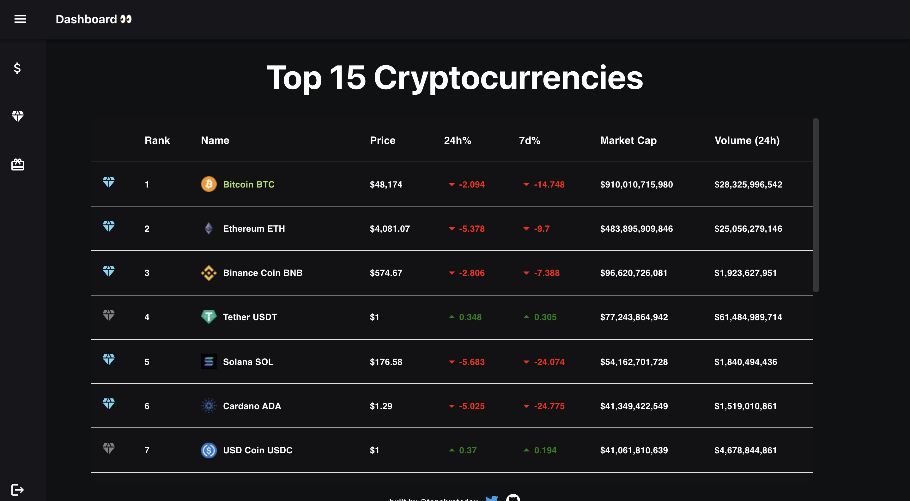 | 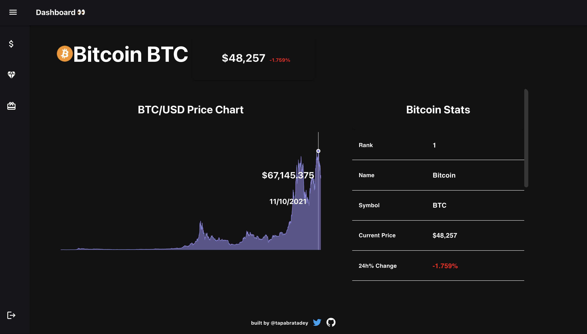 | 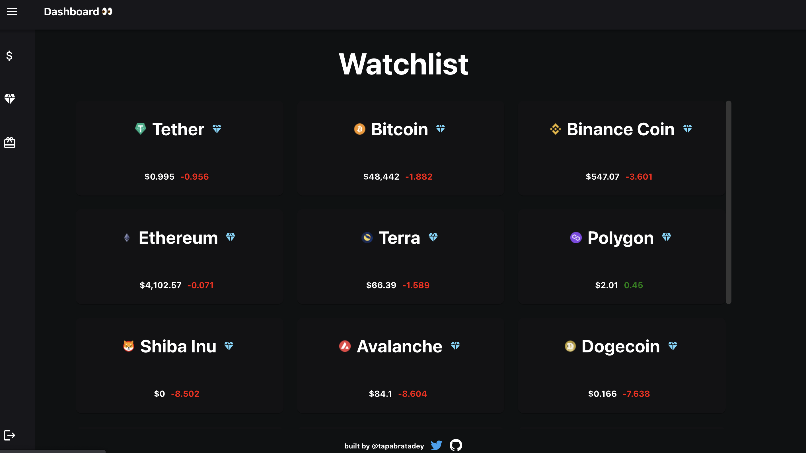 | 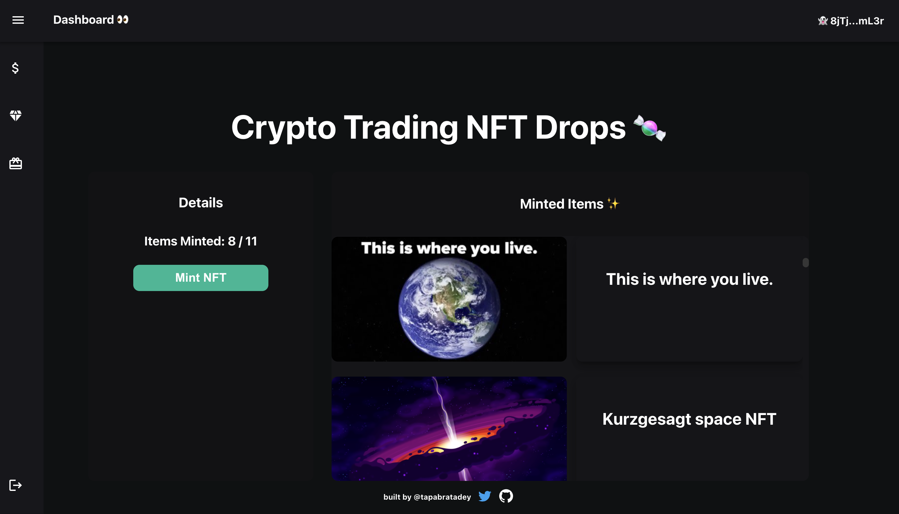 |

|                Landing Page                 |                 Register                  |                 Login                 |                   NFT Auth Page                    |
| :-----------------------------------------: | :---------------------------------------: | :-----------------------------------: | :------------------------------------------------: |
|  | 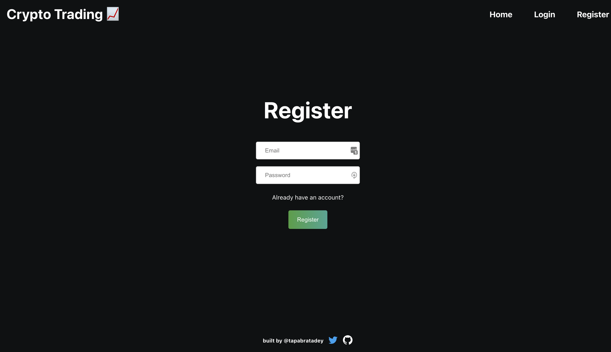 | 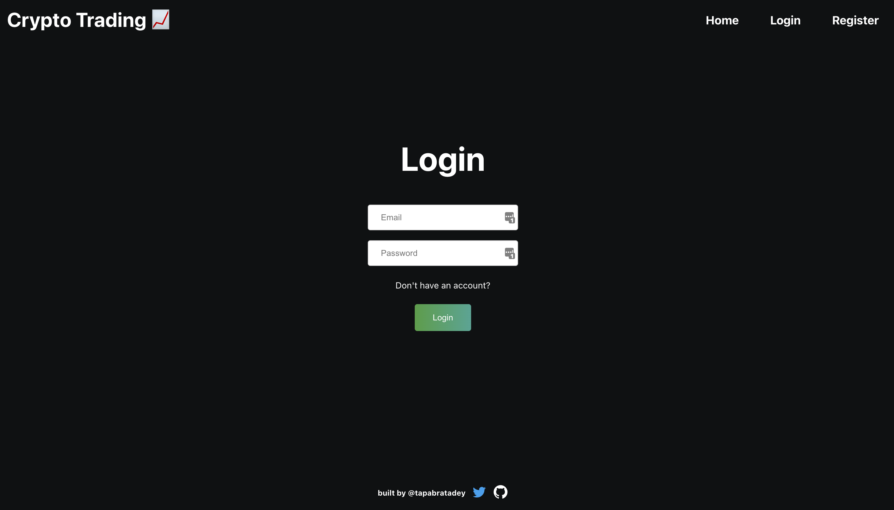 | 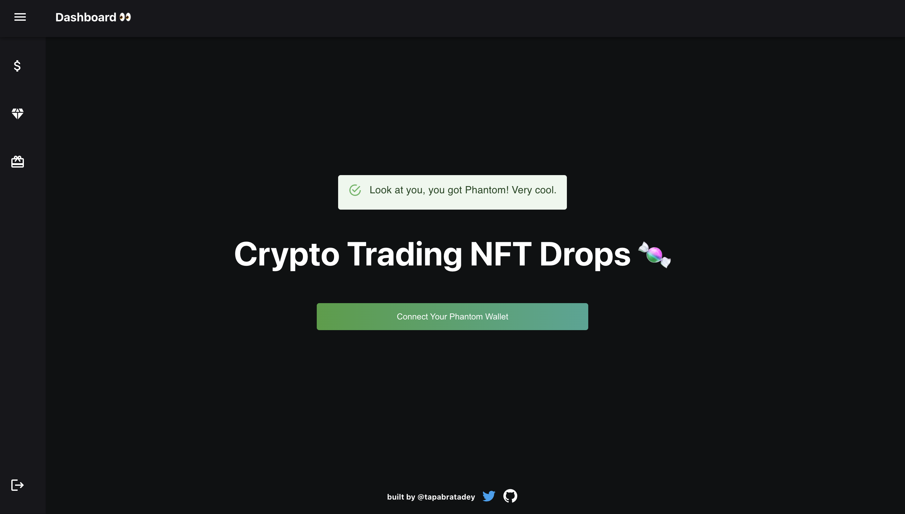 |

### 🚶 Walkthrough

	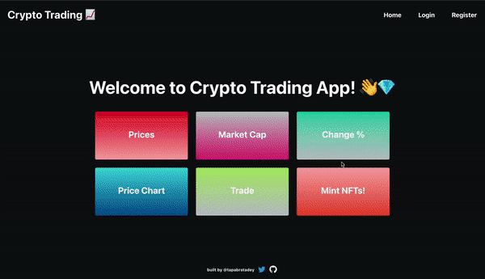

# Project Scope

Donec ultricies egestas augue non dignissim.

## Requirements

| Requirements                                                                                                   | Status | Details                                                                                                                                                                                     |
| -------------------------------------------------------------------------------------------------------------- | ------ | ------------------------------------------------------------------------------------------------------------------------------------------------------------------------------------------- |
| Use of a modern JS Library / Framework like React, Angular, etc                                                | ✅     | React                                                                                                                                                                                       |
| Create an application that can be interacted with in a minimum of three different ways by the user             | ✅     | Login/Register, Cryptocurrencies Table View, Watchlist                                                                                                                                      |
| The usage of a specified architectural pattern (MVC, MVP, MWM,etc.)                                            | ✅     | MVVM                                                                                                                                                                                        |
| Integration with a backend service developed by you with CRUD(create, read, update, delete) operations         | ✅     | RESTful API with NodeJs, Express, Firestore.                                                                                                                                                |
| Integration with a 3rd party RESTful API.                                                                      | ✅     | `CoinGecko API`                                                                                                                                                                             |
| Usage of at least 5 UI components from the material-ui/@core                                                   | ✅     | `Box`, `MuiAppBar`, `MuiDrawer`, `Toolbar`, `List`, `ListItemIcon`, `ListItem`, `Divider`, `IconButton`, `Menu`, `MenuItem`, `Alert`, `AlertTitle`, `Table`, `Card`, `Card Content`, `Grid` |
| An example of a reusable component that you have created and used in the app (e.g. Ul component, service, etc) | ✅     | `<DashboardHeader/>`, `<LandingPageNavBar/>`, `<LoginFormView/>`, `<FooterComponent/>`, `<Home/>`, `<Login/>`, `<Register/>`, `<Assets/>`, `<Crypto/>`, `<Watchlist/>`, `<NFT/>`            |

### Functionalities

| A user can...                                                                   |
| ------------------------------------------------------------------------------- |
|                                                                                 |
| View prices, market cap, change %, and price charts of various cryptocurrencies |
| View Watchlist                                                                  |
| Register                                                                        |
| Login                                                                           |
| Logout                                                                          |
| Mint an NFT                                                                     |

## Project Architecture

Talk about the implemented architecture\*. V1: MVVM. V2: Flux

### Backend

Layered architecture with RESTful API with CRUD operations.

### Frontend

MVVM architecture for this project using MobX for state management for React Components.

### Folder Structure

#### Backend

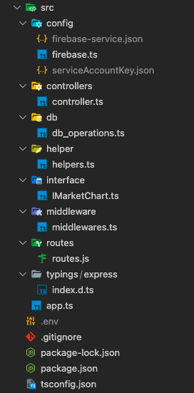

#### Frontend

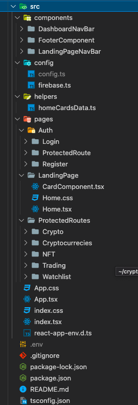

# User Flow

Talk about how users can interact w/ the app.

	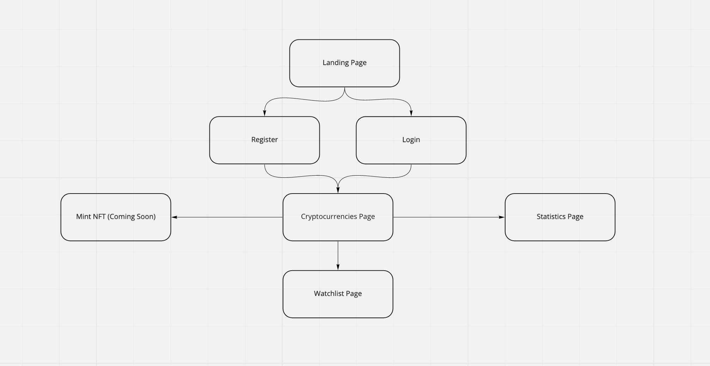

## Backend

## Frontend

# Project Management

I'm using GitHub Kanban to plan and organize different stages of this project.

You can view public my GitHub board [here](https://github.com/tapabratadey/crypto-trading/projects/1).

# Installation

Write the installation instructions here.

# Hosted Link

[crypto-trading-btc.netlify.com](https://crypto-trading-btc.netlify.app/)
