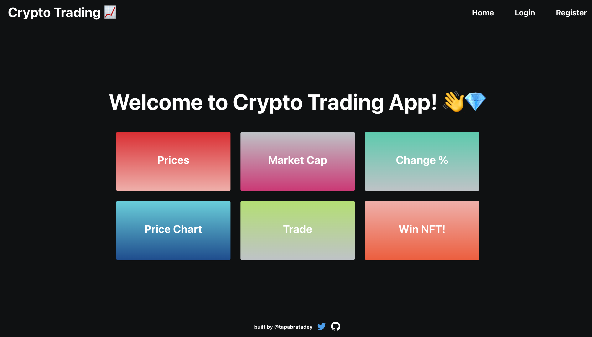

# 📈 Crypto Trading

Crypto Trading is a web app that displays information about the price, market cap, change in price over time, price charts of various cryptocurrencies like Bitcoin and Ethereum. The app also lets users take add assets to their watchlist.

<h3 align="left">Built with:</h3>
 
 
 
<a href="https://www.mongodb.com/" target="_blank" rel="noreferrer"> 

## 🤳 Project Screenshots

---

### Landing Page

### Register Page

### Login Page

### Cryptocurrencies Page

### Statistics Page

### Watchlist Page

### NFT Auth Page

### NFT Mint Page

### Side Drawer

## 🎯 Project Scope

| Requirements                                                                                                   | Status | Details                                                                                                                                                                                     |
| -------------------------------------------------------------------------------------------------------------- | ------ | ------------------------------------------------------------------------------------------------------------------------------------------------------------------------------------------- |
| Use of a modern JS Library / Framework like React, Angular, etc                                                | ✅     | React                                                                                                                                                                                       |
| Create an application that can be interacted with in a minimum of three different ways by the user             | ✅     | Login/Register, Cryptocurrencies Table View, Watchlist                                                                                                                                      |
| The usage of a specified architectural pattern (MVC, MVP, MWM,etc.)                                            | ✅     | MVVM                                                                                                                                                                                        |
| Integration with a backend service developed by you with CRUD(create, read, update, delete) operations         | ✅     | RESTful API with NodeJs, Express, Firestore.                                                                                                                                                |
| Integration with a 3rd party RESTful API.                                                                      | ✅     | `CoinGecko API`                                                                                                                                                                             |
| Usage of at least 5 UI components from the material-ui/@core                                                   | ✅     | `Box`, `MuiAppBar`, `MuiDrawer`, `Toolbar`, `List`, `ListItemIcon`, `ListItem`, `Divider`, `IconButton`, `Menu`, `MenuItem`, `Alert`, `AlertTitle`, `Table`, `Card`, `Card Content`, `Grid` |
| An example of a reusable component that you have created and used in the app (e.g. Ul component, service, etc) | ✅     | `<DashboardHeader/>`, `<LandingPageNavBar/>`, `<LoginFormView/>`, `<FooterComponent/>`, `<Home/>`, `<Login/>`, `<Register/>`, `<Assets/>`, `<Crypto/>`, `<Watchlist/>`, `<NFT/>`            |

## 🔬 Functionalities

| A user can...                                                                   |
| ------------------------------------------------------------------------------- |
|                                                                                 |
| View prices, market cap, change %, and price charts of various cryptocurrencies |
| View Watchlist                                                                  |
| Register                                                                        |
| Login                                                                           |
| Logout                                                                          |
| Mint an NFT                                                                     |

## 🏛 Architecture

1. Frontend: MVVM architecture for this project using MobX for state management for React Components.
2. Backend: Layered architecture with RESTful API with CRUD operations.

## User Flow

---

## Project Structure

---

## Frontend

 

## Backend

---

## 🗂 GitHub Kanban

I'm using GitHub Kanban to plan and organize different stages of this project.

You can view public my GitHub board [here](https://github.com/tapabratadey/crypto-trading/projects/1).

## 🧪 Technologies Used
